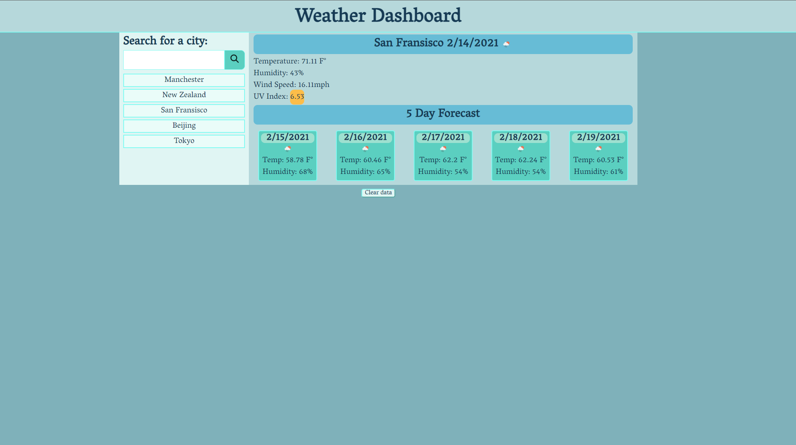

# Weather-Dashboard

This project is a practice on using api and ajax. It is weather checking application where the user can enter in a city and find the its current weather, temperature, 5 day update and more. The application also keeps track of past cities that the user has searched for and can quickly bring up the latest information for that city. On a page load, the last city to be manually searched for is brought up. A clear button is provided to clear the search history.
View the deployed project here: https://ejhuang2015.github.io/Weather-Dashboard/

## Prerequisites

Any web browswer that allows the user to open and view HTML files will do.

## Contributors

Thanks to the following people who have contributed to this project:

* [Scott Byer](https://github.com/switch120) 
* [Mike Fearly](https://michaelfearnley.com/)
* UNH Full Stack Development Bootcamp

## Contact

If you want to contact me you can reach me at <ejhuang.2015@gmail.com>.

## License
### Copyright (c) [2021] [Edward Huang]

Permission is hereby granted, free of charge, to any person obtaining a copy
of this software and associated documentation files (the "Software"), to deal
in the Software without restriction, including without limitation the rights
to use, copy, modify, merge, publish, distribute, sublicense, and/or sell
copies of the Software, and to permit persons to whom the Software is
furnished to do so, subject to the following conditions:

The above copyright notice and this permission notice shall be included in all
copies or substantial portions of the Software.

THE SOFTWARE IS PROVIDED "AS IS", WITHOUT WARRANTY OF ANY KIND, EXPRESS OR
IMPLIED, INCLUDING BUT NOT LIMITED TO THE WARRANTIES OF MERCHANTABILITY,
FITNESS FOR A PARTICULAR PURPOSE AND NONINFRINGEMENT. IN NO EVENT SHALL THE
AUTHORS OR COPYRIGHT HOLDERS BE LIABLE FOR ANY CLAIM, DAMAGES OR OTHER
LIABILITY, WHETHER IN AN ACTION OF CONTRACT, TORT OR OTHERWISE, ARISING FROM,
OUT OF OR IN CONNECTION WITH THE SOFTWARE OR THE USE OR OTHER DEALINGS IN THE
SOFTWARE.
